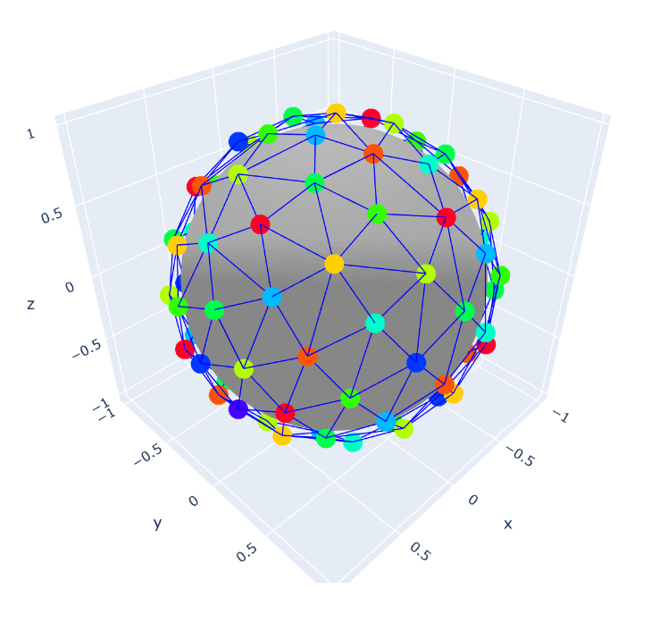
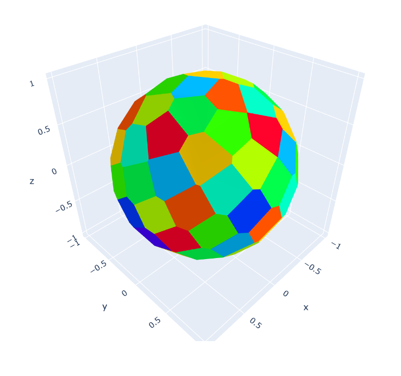

# Задача 10

### Быстрый старт

1. Перейти в папку `task10`
2. Установить зависимости `pip install -r requirements.txt`
3. Установить проект `pip install -e .`
4. Запустить `runDemo.py` (рассчёт для 64000 вершин и 1008 цветов идёт примерно 1 час и 20 минут)

### Постановка задачи

Реализуйте вычислительную процедуру, позволяющую равномерно расположить $N$ точек на поверхности сферической Земли. Воспользовавшись этой процедурой, разделите поверхность Земли на $64000$ примерно одинаковых областей (сот). Назначьте всем сотам номера от $1$ до $1008$ так, чтобы максимизировать минимальное расстояние между центрами сот с одинаковыми номерами.

Дополнительно к задаче 10, предлагается чуть более сложная формулировка - определить минимальное количество литер (номеров) для обеспечения $2$-дистанционной раскраски.

### Декомпозиция задачи

1. Сделать процедуру равномерного распределения точек на поверхности сферы
2. Разделить поверхность сферы на области в соответствии с этими точками
3. Сделать граф "связей" между этими областями
4. Раскрасить граф в $1008$ цветов так, что бы максимизировать минимальное расстояние между разными цветами
5. Минимизировать количество цветов $2$-дистанционной раскраски графа

### Описание решения

1. Для равномерного распределения точек сфере реализована решётка Фибоначчи.
2. Для разбиения сферы на области в соответствии с точками из предыдущего пункта использована диаграмма Вороного. Диаграмма Вороного хороша двумя свойствами: 
    1. Диаграмма Вороного относительно множества точек $S$ разбивает сферу на области. Причём, каждая такая область образует множество точек, более близких к одному из элементов множества $S$, чем к любому другому элементу множества.
    2. Две области из диаграммы Вороного имеют общее ребро (граничат) тогда и только тогда, когда опорные точки этих областей соеденены ребром в разбиении Делоне.
Первый пункт - достаточно естественное требование для "равномерного" разбиения сферы. Второй пункт даёт теоретическое удобство для обработки разбиения.
3. Для построения графа связей была взята выпуклая оболочка точек из пункта 1. (**Что эквивалентно сферическому разбиению Делоне** см. https://docs.scipy.org/doc/scipy/reference/generated/scipy.spatial.SphericalVoronoi.html)
4. Были реализованы алгоритмы раскраски графа - жадный и DSATUR. Оба алгоритма были обобщены для поиска $d$-дистанционной раскраски следующим образом: перед началом алгоритма берётся $d$-я степень графа. Описание корректности данного подхода описано в *"МИНИМАЛЬНЫЕ СТЕПЕНИ И ХРОМАТИЧЕСКИЕ ЧИСЛА КВАДРАТОВ ПЛОСКИХ ГРАФОВ" О. В. Бородин, X. Брусма, А. Н. Глебов, Я. ван ден Хойвел*, стр. 2, абзацы 2-3.
5. Раскраска графа в $1008$ цветов так, что бы максимизировать минимальное расстояние между разными цветами реализована в функции `calcMaxColoringDistance`. Она разбита на два этапа:
    1. Расширяющийся поиск дистанции раскраски: начинаем с дистанции $1$ и на каждам шаге умножаем её на $2$. Делаем до тех пор, пока алгоритм расскраски на $k$-м шаге не сделает отказ.
    2. Бинарный поиск дистанции раскраски. На предыдущеем шаге мы получили верхнюю и нижнюю оценки для искомой дистанции. Это $2^{k-1}$ и $2^k$ соответственно.
6. Минимизация количества цветов для $2$-дистанционной раскраски делается расширяющимся поиском, как в предыдущем пункте. Дальнейшее сужение тут не нужно, так как сам алгоритм выдаёт число использованных цветов.

### Описание проекта

### Картинки

### Численный эксперимент

В левом столбце указано количество верши, в верхней строке указаон количество цветов. В ячейках таблицы указано время исполнения программы

| Вершины\цвета | 20     | 100    | 500    | 1008         |
| ------------- | ------ | ------ | ------ | ------------ |
| 100           | >1 сек | >1 сек | >1 сек | >1 сек       |
| 1000          | 2 сек  | 3 сек  | 20 сек | 22 сек       |
| 10000         | 8 сек  | 25 сек |        |              |
| 64000         |        |        |        | 1 час 20 мин |

### Стиль кода

Старался придерживаться файла *StyleGuide - Matlab.pdf*. Однако, мог что-то проглядеть и по привычке написать по PEP8.