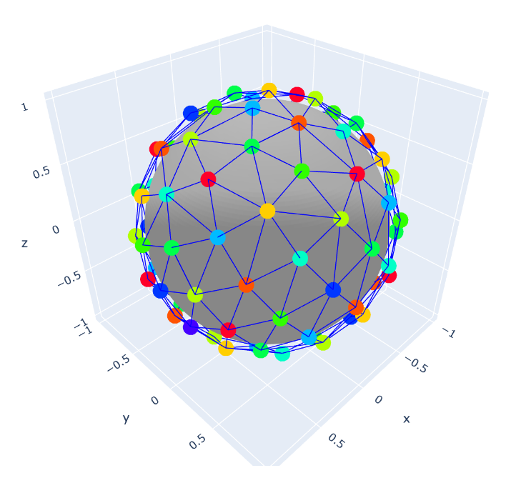
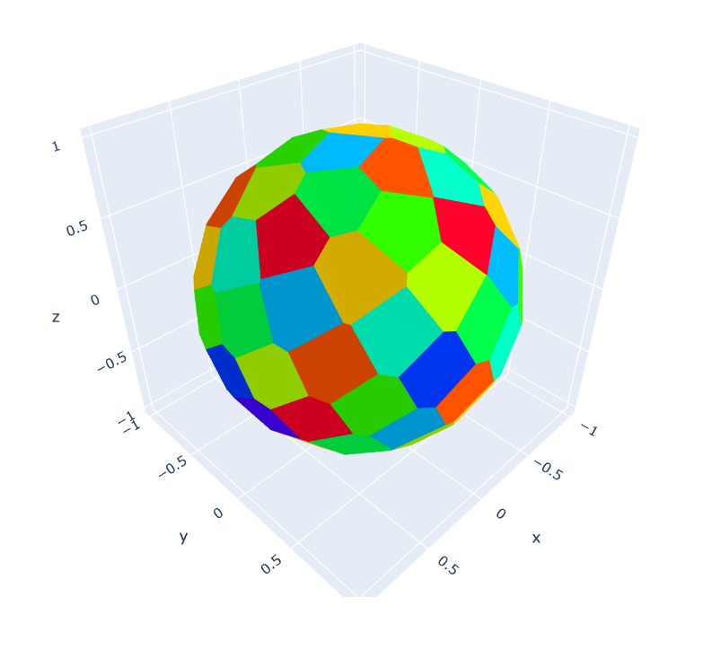

# Задача 10

### Быстрый старт

1. Перейти в папку `task10`
2. Установить зависимости `pip install -r requirements.txt`
3. Установить проект `pip install -e .`
4. Запустить `runDemo.py` (рассчёт для $64000$ вершин и $1008$ цветов идёт примерно *11 минут*)

В файле `runDemo.py` основная функция - `run`. В ней запускается следующая процедура:
1. Отображается 2-дистанционная раскраска графа со $100$ вершинами в 3D.
2. Идут два расчёта на небольших данных - каждый по $100$ вершин. Первый расчёт использует жадную стратегию раскрашивания. Второй использует *DSATUR*. Данный шаг нужен для сравнения двух стратегий.
3. Запускается основной рассчёт для $64000$ вершин.

---

### Постановка задачи

Реализуйте вычислительную процедуру, позволяющую равномерно расположить $N$ точек на поверхности сферической Земли. Воспользовавшись этой процедурой, разделите поверхность Земли на $64000$ примерно одинаковых областей (сот). Назначьте всем сотам номера от $1$ до $1008$ так, чтобы максимизировать минимальное расстояние между центрами сот с одинаковыми номерами.

Дополнительно к задаче 10, предлагается чуть более сложная формулировка - определить минимальное количество литер (номеров) для обеспечения $2$-дистанционной раскраски.

---

### Декомпозиция задачи

1. Сделать процедуру равномерного распределения точек на поверхности сферы
2. Разделить поверхность сферы на области в соответствии с этими точками
3. Сделать граф "связей" между этими областями
4. Раскрасить граф в $1008$ цветов так, что бы максимизировать минимальное расстояние между разными цветами
5. Минимизировать количество цветов $2$-дистанционной раскраски графа

---

### Описание решения

1. Для равномерного распределения точек сфере реализована решётка Фибоначчи.
2. Для разбиения сферы на области в соответствии с точками из предыдущего пункта использована диаграмма Вороного. Диаграмма Вороного хороша двумя свойствами: 
    1. Диаграмма Вороного относительно множества точек $S$ разбивает сферу на области. Причём, каждая такая область образует множество точек, более близких к одному из элементов множества $S$, чем к любому другому элементу множества.
    2. Две области из диаграммы Вороного имеют общее ребро (граничат) тогда и только тогда, когда опорные точки этих областей соеденены ребром в разбиении Делоне.
Первый пункт - достаточно естественное требование для "равномерного" разбиения сферы. Второй пункт даёт теоретическое удобство для обработки разбиения.
3. Для построения графа связей была взята выпуклая оболочка точек из пункта 1. (**Что эквивалентно сферическому разбиению Делоне** см. https://docs.scipy.org/doc/scipy/reference/generated/scipy.spatial.SphericalVoronoi.html)
4. Были реализованы алгоритмы раскраски графа - жадный и DSATUR. Оба алгоритма были обобщены для поиска $d$-дистанционной раскраски следующим образом: на каждом шаге алгоритма, берётся сфера с центром в текущей точке указанного радиуса. 
5. Раскраска графа в $1008$ цветов так, что бы максимизировать минимальное расстояние между разными цветами реализована в функции `calcMaxColoringDistance`. Она разбита на два этапа:
    1. Расширяющийся поиск дистанции раскраски: начинаем с дистанции $1$ и на каждам шаге умножаем её на $2$. Делаем до тех пор, пока алгоритм расскраски на $k$-м шаге не сделает отказ.
    2. Бинарный поиск дистанции раскраски. На предыдущеем шаге мы получили верхнюю и нижнюю оценки для искомой дистанции. Это $2^{k-1}$ и $2^k$ соответственно.
6. Минимизация количества цветов для $2$-дистанционной раскраски делается расширяющимся поиском, как в предыдущем пункте. Дальнейшее сужение тут не нужно, так как сам алгоритм выдаёт число использованных цветов.

---

### Описание проекта

Основной исходный код собран в поддиректории `src/graphcoloring`.
В директории `tests` лежат тесты.

#### src
В директории `src/graphcoloring` лежат четыре файла:
1. `Mesh3D.py` - содержит класс, реализующий 3D меш. Нужна для хранения разбиения Вороного.
2. `SphericalNetwork.py` - содержит класс, реализующий всю сеть целиком. Класс хранит разбиение Вороного в `Mesh3D` и граф связей в `networkx.Graph`. Также, в этом классе реализованы методы построения изначальных графа и меша.
3. `coloring.py` - содержит все необходимые методы для раскрасок и рассчётов, связаных с раскрасками графов. Основные перечислены ниже:
    1. `graphDistanceColoring`- жадный алгоритм раскрашивания
    2. `graphDistanceColoringDsatur` - алгоритм ракрашивания *DSATUR*. Раскрашивает точнее, но требует больше времени, особенно на больших данных
    3. `calcMaxColoringDistance` - алгоритм максимизации минимального расстояния раскраски
    4. `calcMinimumColors` - минимизация количества цветов для раскраски графа. Дистанция передаётся как параметр
4. `draw.py` - содержит методы отрисовки графов, 3D меша и класса `SphericalNetwork`.

#### tests

Не совсем понятно как некоторые методы можно покрыть тестами, т.к. основные алгоритмы - это оптимизация.

Тут достаточно трудно придумать какой-то хороший универсальный критерий даже для очень маленьких данных. Поэтому, тестами покрыты те функции, для которых удалось придумать критерий.

---

### Картинки

**Точки и их граф связей**

Картинки приведены для $100$ точек и $16$ цветов

**Разбиение сферы на области Вороного**

---

### Стиль кода

Старался придерживаться файла *StyleGuide - Matlab.pdf*. Однако, мог что-то проглядеть и по привычке написать по PEP8.

В каждом методе есть **docstring** с описанием их сигнатур и возвращаемых значений.